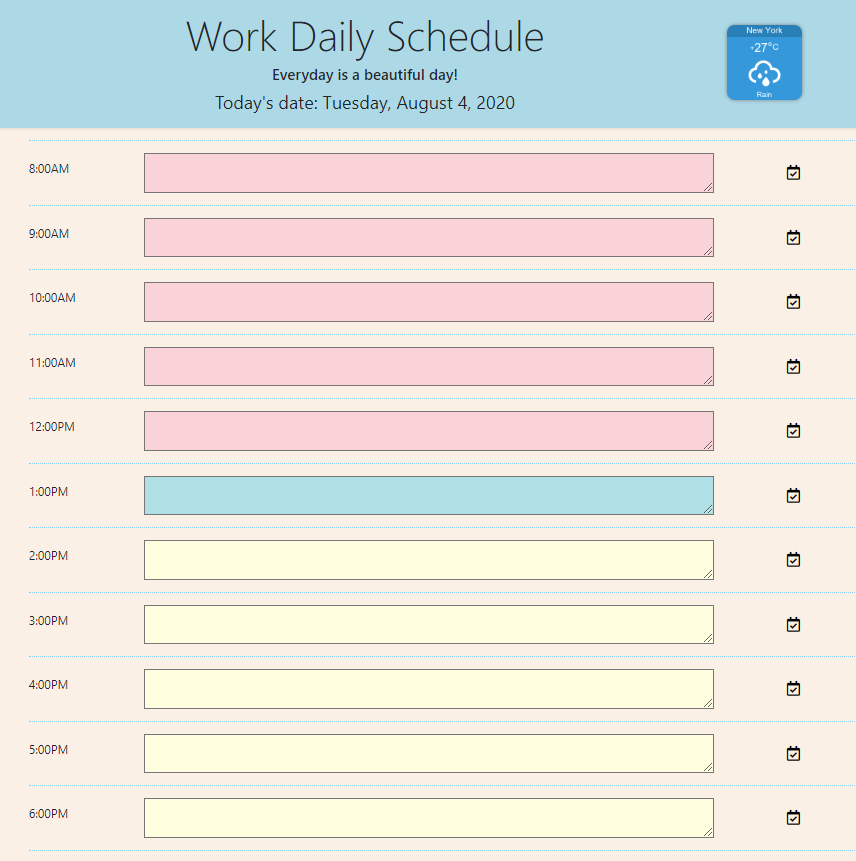

## DAY PLANNER

This day planner allows you to enter tasks during regular business hours. It will also change colors depending on the time of day.

* If the text area is blue, that means it's the present time. 
* If the text area is red, it means the time is past.
* If the text area is yellow, it means the task is in the future. 

Once you're finished organizing your day, click on the checkmark icon to save your task and it should appear the next time you open the page. 

Enjoy!

## How to access the Travel Destination quiz

The location of the index.html file is at:

* URL: https://johnsbrook.github.io/05_Day_Planner/ 
* GitHub Repository: https://github.com/johnsbrook/05_Day_Planner 

Either, click on the link above to open on the computer or mobile device's default browser or copy and paste on the preferred browser. 

BEST OF LUCK!

